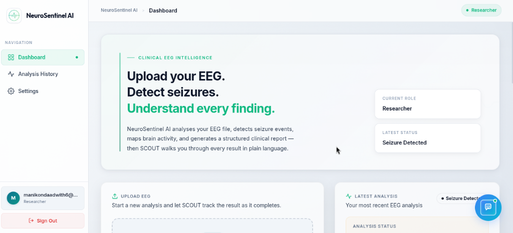
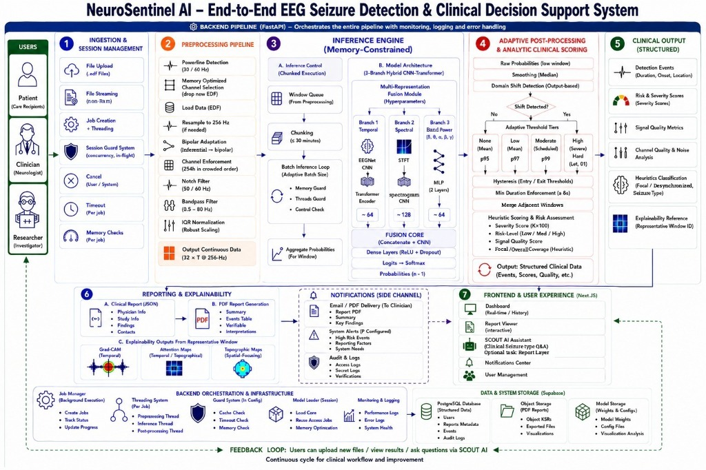
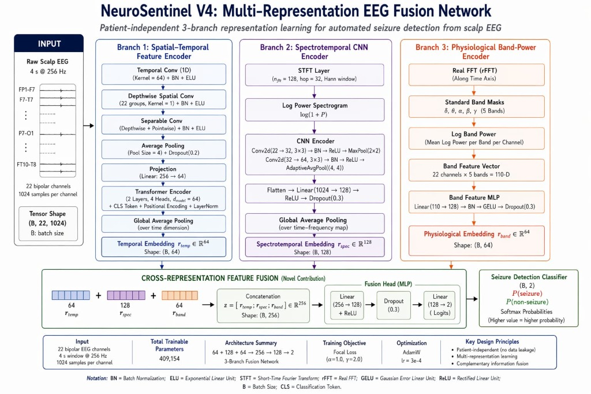

<div align="center">


# NeuroSentinel AI

### NeuroSentinel V4 · Multi-Representation EEG Fusion Network

AI-powered EEG signal analysis framework for automated seizure detection and clinical decision support — from raw `.edf` to a structured clinical report in minutes.

[](https://neuro-sentinel-ai-6vfv.vercel.app)
[](https://huggingface.co/spaces/Manikondaadwith/neurosentinel-backend)
[](https://huggingface.co/manikondaadwith/neurosentinel-v4)
[](docs/technical_guide.md)
[](docs/technical_guide.md)
[](docs/technical_guide.md)
[](LICENSE)

**[🚀 Live Demo](https://neuro-sentinel-ai-6vfv.vercel.app) · [🤗 Backend API](https://huggingface.co/spaces/Manikondaadwith/neurosentinel-backend) · [🧠 Model Weights](https://huggingface.co/manikondaadwith/neurosentinel-v4) · [📖 Technical Docs](docs/technical_guide.md)**

</div>

---

<table>
<tr>
<td width="58%">

## What is NeuroSentinel AI?

NeuroSentinel AI is a **clinical decision support system** that detects seizure events in scalp EEG recordings. Upload an `.edf` file and receive a full structured clinical report in minutes:

- 📍 Seizure event timeline with onset, offset & duration
- ⚠️ Risk & severity scoring (Low / Medium / High / Critical)
- 🧠 GradCAM + attention-map explainability per event
- 📊 Band-power frequency analysis (δ θ α β γ)
- 🤖 **SCOUT** AI assistant for patient-facing Q&A
- 📄 Downloadable PDF report for neurologist review
- 📧 Email delivery to clinician on completion

**No per-patient fine-tuning. No GPU required. Cross-dataset generalization out-of-the-box.**

> ⚕️ Decision support tool only. Not FDA approved. Does not replace clinical judgment.

</td>
<td width="42%">

## Results

| Metric | Value |
|:---|---:|
| Window Accuracy | **99.55%** |
| Macro F1 *(primary)* | **0.979** |
| ROC-AUC | **0.980** |
| PR-AUC | **0.9474** |
| Sensitivity (window) | **97.75%** |
| Specificity (window) | **99.59%** |
| Event Sensitivity | **73.3%** (22/30) |
| Event FP / hour | **0.98** |
| Detection Latency | **3.5 s** median |
| Zero-shot Siena | **80.0%** sensitivity |
| Model Parameters | **409,154** |

*Evaluated on CHB-MIT (patient-level splits, no leakage). Zero-shot on Siena Scalp EEG.*

</td>
</tr>
</table>

---

## Dashboard



*Live at [neuro-sentinel-ai-6vfv.vercel.app](https://neuro-sentinel-ai-6vfv.vercel.app) — upload any `.edf` file to get a full clinical report.*

---

## Key Features

| | Feature | Detail |
|---|---|---|
| 🧠 | **3-Branch Fusion Model** | Simultaneously processes raw EEG, spectrograms, and band-power — capturing temporal, spectral, and frequency-domain patterns in one forward pass |
| 🌍 | **Cross-Dataset Generalization** | Trained on CHB-MIT (pediatric), zero-shot tested on Siena Scalp EEG (adult, referential montage) with 80% event sensitivity |
| 🎯 | **Domain-Adaptive Post-Processing** | Output-based domain shift detection drives 4-tier adaptive thresholds — no manual calibration needed for new hospitals |
| 🩺 | **3-State Diagnostic Machine** | `DETECTED` / `SUSPICIOUS` / `CLEAR` — eliminates contradictory reporting between model output and post-processing filters |
| 💡 | **Full Explainability** | GradCAM (temporal), attention maps (topographic), representative window ID for every event |
| ⚡ | **Memory-Efficient Inference** | Chunked execution (50-window chunks, ≤4 MB) designed for Hugging Face Spaces free tier (2 GB RAM) |
| 🤖 | **SCOUT AI Assistant** | Gemini-powered, state-aware Q&A — explains findings differently for patients vs. clinicians |
| 🏗️ | **Production Stack** | Next.js 14 + FastAPI + Supabase + Docker — fully deployed, not a research notebook |

---

## Architecture



### Model: MultiRepEEGModel V4



**409,154 parameters · 3-Branch Fusion · Focal Loss (α=1.0, γ=2.0) · AdamW lr=3e-4 · Early stop @ epoch 5**

> 📦 **Pre-trained weights available on Hugging Face:** [`manikondaadwith/neurosentinel-v4`](https://huggingface.co/manikondaadwith/neurosentinel-v4)

---

## Quick Start

### Prerequisites
- Node.js ≥ 18 / npm ≥ 9 (frontend)
- Python ≥ 3.11 (backend)
- [Supabase](https://supabase.com) project
- [Google Gemini](https://ai.google.dev) API key

### 1 — Clone

```bash
git clone https://github.com/Manikondaadwith/kmec-ps-G1108.git
cd kmec-ps-G1108
```

### 2 — Backend

```bash
cd neurosentinel-backend
python -m venv .venv && source .venv/bin/activate
pip install -r requirements.txt
# or: pip install -e ".[dev]"

cp ../.env.example .env   # fill in SUPABASE_URL, SUPABASE_SERVICE_KEY, GEMINI_API_KEY
uvicorn app.main:app --reload --port 7860
```

### 3 — Frontend

```bash
cd neurosentinel
npm install
cp .env.example .env.local   # fill in all values
npm run dev
```

Open [http://localhost:3000](http://localhost:3000) — upload any `.edf` file to test.

### Docker (matches Hugging Face Spaces exactly)

```bash
cd neurosentinel-backend
docker build -t neurosentinel-backend .
docker run -p 7860:7860 --env-file .env neurosentinel-backend
```

---

## Repository Structure

```
kmec-ps-G1108/
│
├── neurosentinel/                  # Next.js 14 frontend → Vercel
│   ├── app/
│   │   ├── api/                    # Auth, upload, job-poll, chat, PDF routes
│   │   ├── components/             # SCOUT UI, notification toasts
│   │   ├── dashboard/              # Upload zone, report list, settings
│   │   └── report/[id]/            # Interactive report viewer
│   ├── lib/                        # Supabase clients, types, UI config
│   └── .env.example                # ← copy to .env.local
│
├── neurosentinel-backend/           # FastAPI backend → Hugging Face Spaces
│   ├── app/
│   │   ├── pipeline/
│   │   │   ├── model.py            # MultiRepEEGModel V4 definition
│   │   │   ├── preprocessing.py    # EDF → 22ch bipolar, bandpass, windowing
│   │   │   ├── inference.py        # Chunked inference + domain-adaptive PP
│   │   │   ├── reporting.py        # Diagnostic state machine
│   │   │   └── explainability.py   # GradCAM + attention maps
│   │   └── services/
│   │       ├── analysis_service.py # Job orchestration
│   │       ├── pdf.py              # PDF report generation (ReportLab)
│   │       ├── email.py            # Email delivery
│   │       └── scout/              # SCOUT AI (Gemini-powered)
│   ├── tests/                      # Pytest suite (4 modules)
│   ├── requirements.txt            # pip-installable deps
│   ├── Dockerfile                  # HF Spaces container
│   └── .env.example                # Backend env vars
│
├── docs/
│   ├── technical_guide.md          # Deep-dive: ML pipeline, metrics, decisions
│   ├── system_architecture.png     # Full system architecture diagram
│   └── supabase_schema.sql         # Database schema
│
├── assets/
│   ├── logo.jpeg                   # Project logo
│   └── screenshots/
│       └── dashboard.png           # Live app screenshot
│
├── NeuroSentinel_AI_production.ipynb  # Training & evaluation notebook
├── CHANGELOG.md
├── CONTRIBUTING.md
└── LICENSE                         # MIT
```

---

## Dataset

| | CHB-MIT *(Training)* | Siena Scalp EEG *(Zero-shot)* |
|---|---|---|
| Source | PhysioNet | PhysioNet (AWS S3) |
| Patients | 23 pediatric | 14 adult |
| Files | 686 EDF | 11 EDF |
| Channels | 22-ch bipolar (10-20) | Referential → converted |
| Sampling Rate | 256 Hz | Variable → resampled |
| Seizure Files | 141 annotated | Verified GT for 5 |
| **Split** | Patient-level (no leakage) | Zero-shot test only |

Training split: `chb01–chb16` (train) · `chb17–chb20` (val) · `chb21–chb24` (test)

---

## Deployment

| Service | Platform | Config |
|---|---|---|
| Frontend | [Vercel](https://vercel.com) | Root dir: `neurosentinel/` · env vars in dashboard |
| Backend | [Hugging Face Spaces](https://huggingface.co/spaces/Manikondaadwith/neurosentinel-backend) | Docker SDK · `neurosentinel-backend/Dockerfile` |
| Database | [Supabase](https://supabase.com) | Apply `docs/supabase_schema.sql` |
| Model Weights | [Hugging Face Hub](https://huggingface.co/manikondaadwith/neurosentinel-v4) | `multirep_best_model_v4.pt` — publicly downloadable |

> A GitHub Actions cron (`.github/workflows/hf-keep-awake.yml`) pings the HF Space every 24h to prevent cold-start sleep.

---

## Comparison with Published Models

| Model | Accuracy | Sensitivity | Macro F1 | AUC | Params | Cross-Dataset |
|---|---|---|---|---|---|---|
| **NeuroSentinel V4** | **99.55%** | **97.75%** | **0.979** | **0.980** | **409K** | ✅ Siena 80% |
| EEGNet (Lawhern 2018) | ~93% | ~88% | ~0.85 | ~0.94 | ~2.6K | ❌ |
| CNN-LSTM Hybrid (2023) | 97.2% | 96.1% | 0.92 | 0.97 | ~1.2M | ❌ |
| CNN-Transformer (2024) | 98.1% | 97.0% | 0.95 | 0.98 | ~800K | ❌ |
| Patient-Specific DL (2024) | 99.1% | 97–100% | 0.96 | 0.99 | ~500K | ❌ per-patient |

*Patient-level train/val/test splits — no patient appears in multiple sets.*

---

## Roadmap

- [ ] **Temporal chunking** for EDF files > 200 MB (current RAM ceiling)
- [ ] **REST API SDK** — Python client for direct programmatic access
- [ ] **Multi-file batch upload** — analyze a full patient session at once
- [ ] **Adult EEG dataset** — expand training beyond pediatric CHB-MIT
- [ ] **ONNX export** — for edge/mobile deployment
- [ ] **Real-time streaming** — WebSocket-based live EEG feed support
- [ ] **LTM monitoring dashboard** — long-term monitoring trend graphs

---

## Testing

```bash
cd neurosentinel-backend
pytest tests/ -v
```

```bash
cd neurosentinel
npm run lint
```

---

## Contributing

See [CONTRIBUTING.md](CONTRIBUTING.md). Issues and pull requests are welcome.

---

## License

[MIT](LICENSE) · Built by **Team G1108 · KMEC · 2026**
